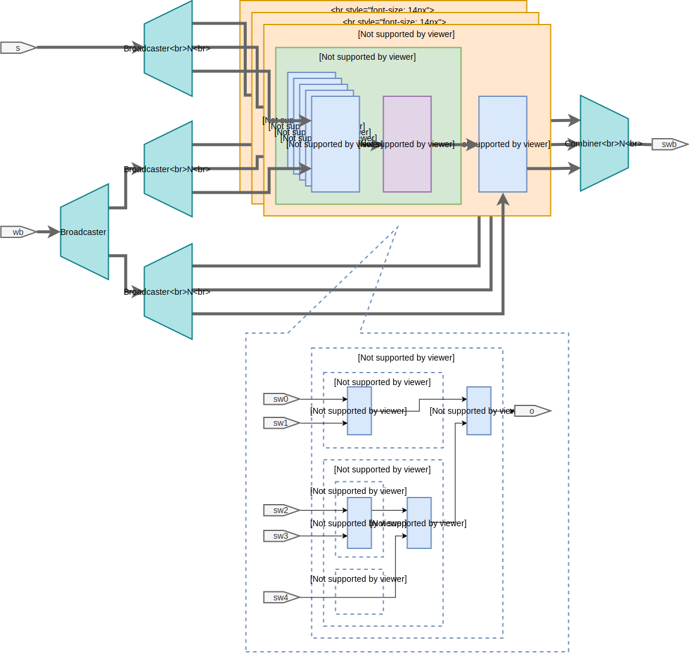

# LSI-Design-Contest-2019 report

## Team Information

チーム名：とっとこタム太郎  
学校名：九州工業大学 大学院 生命体工学研究科 田向研究室  
電話番号：093-695-6143（研究室）  
住所：〒808-0196 福岡県北九州市若松区ひびきの２−４  
メールアドレス：？（代表）

## メンバーリスト

|学年|氏名|Tシャツのサイズ|
|:---|:---|:---|
|D1|川島 一郎|M|
|D1|田中 悠一朗|L|
|M1|宮﨑 椋瑚|M|

## 設計のタスクレベル

---

## 回路ブロックもしくは、アーキテクチャ記述

<!---

図．回路ブロック

-->

---

## 設計した回路の機能の説明など
### 積和演算回路

<!---

図．積和演算回路

-->

### 活性化関数回路
以下に，活性化関数回路のブロック図を示す．

活性化関数回路は，自身のレイヤーの積和演算回路から入力を受け付ける．
活性化関数回路に入力された信号は，ニューロンの内部状態毎に分割され，各信号は図に示すReLUブロックへと入力される．

ReLUブロックは入力された信号を，0からMAX（出力信号のビット幅で取りうる最大値）までクリッピングする．
本来のReLU関数は，出力値に上限はない．しかし，本設計回路では活性化関数の出力値のビット幅を制限する仕様とした．これは，ニューラルネットワークの層を経る毎に，ニューロンの入力信号のビット幅を増加させないためである．

各ReLUブロックが計算した値は，全てBroadcasterへと入力される．
Broadcasterによって，活性化関数回路の出力は，次のレイヤーの積和演算回路と，自身の重み・バイアス回路に入力される．

<!---

図．活性化関数回路

-->

### 誤差伝播回路

<!---

図．誤差逆伝播回路

-->

### 重み・バイアス回路
以下に，重み・バイアス回路を示す．

重み・バイアス回路は，活性化関数回路と誤差逆伝播回路から入力を受け付ける．
各信号は，まずCombinerに入力される．
したがって，活性化関数回路の出力（図中 y1）と，誤差逆伝播回路の出力（図中 d0）の両方が揃ってから，重みとバイアスの更新の処理を開始する．

上記信号はまず，Learning rateブロックへと入力される．
Learning rateブロックはd0に学習率を乗じた値（図中 ad）を出力する．
このadは，バイアスの更新量（図中 db）に相当する．
このブロックでは，y1については処理を加えない．
上記adとy1はPipeline Registerを通じて，Delta_wブロックへと入力される．
Delta_wブロックは，y1とadの乗算（図中 dW）を出力する．
このdWは，重みの更新量に相当する．
上記dbとdWはUpdateブロックへと入力される．
Updateブロック内には，重みとバイアスの値を保存するレジスタがある．
入力されたdbとdWを用いて，バイアスと重みの更新を行う．

更新された重みとバイアスはBroadcasterへと入力される．
Broadcasterによって，重みとバイアスが自身のレイヤーの積和演算回路へ入力され，重みが前のレイヤーの誤差逆伝播回路へ入力される．

<!---

図．重み・バイアス回路

-->

---

## アピールポイントと独創性
Combiner・Broadcasterを用いたStream形式でモジュール間の通信を行う．

---

## クリティカルパス速度、回路領域
論理合成ツールとしてXilinx Vivado 2018.2を使用した．
ターゲットデバイスはXilinx Virtex UltraScaleとした．

### クリティカルパス速度

### 回路領域
ニューラルネットワークのパラメータのうち，変数のビット幅，および中間層１のユニット数を可変にして，論理合成後の回路規模がどのようになるか確認した．

---

## HDLコード
GitHubにて公開．  
https://github.com/IchiroKawashima/LSI-Design-Contest-2019/

---

## デザインが操作しているシミュレーション波形の表示
