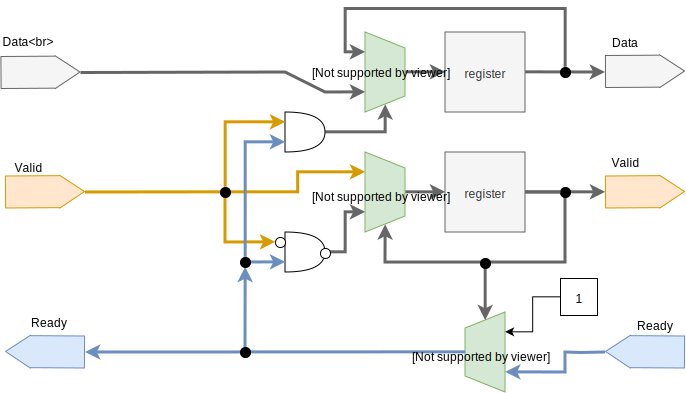
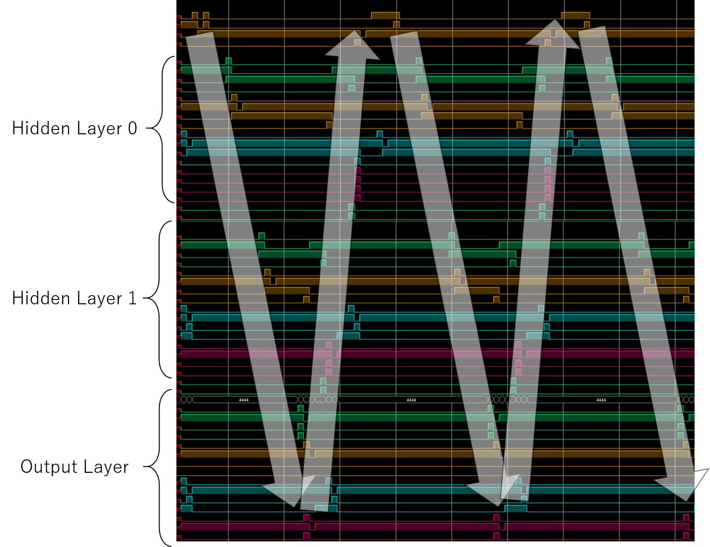
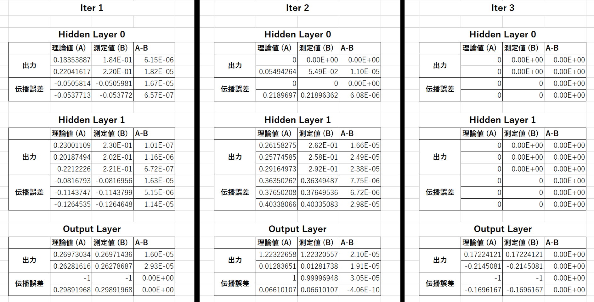

# LSIデザインコンテスト2019 レポート

## Team Information

チーム名：とっとこタム太郎（仮）  
学校名：九州工業大学 大学院 生命体工学研究科 田向研究室  
電話番号：093-695-6143（研究室）  
住所：〒808-0196 福岡県北九州市若松区ひびきの２−４  

## メンバーリスト

|学年|氏名|メールアドレス|Tシャツのサイズ|
|:---|:---|:---|:---|
|D1|川島 一郎|kawashima.ichiro172@mail.kyutech.jp|M|
|D1|田中 悠一朗|tanaka.yuichiro483@mail.kyutech.jp|L|
|M1|宮﨑 椋瑚|miyazaki.ryogo211@mail.kyutech.jp|M|

## 設計のタスクレベル

<!--- break -->

## 1. 回路ブロックもしくは、アーキテクチャ記述
図1.1に，今回設計したニューラルネットワーク回路のブロック図を示す．
図は，2層の隠れ層と1層の出力層から成る，Multi Layer Perceptron（MLP）を示している．
各層は，以下の4種類の回路モジュールの組み合わせで構成されている．
* 積和演算回路（Maccum）
* 活性化関数回路（Neuron）
* 誤差逆伝播回路（Delta）
* 重み・バイアス回路（BiasWeight）

回路は下記に示すパラメータを持ち，回路を構成する4つのモジュールは，パラメタライズされている．後述する回路規模の検証では，このパラメータを可変にすることで回路規模の変化を確認する．
* NI：入力層のニューロン数
* NH0：隠れ層0のニューロン数
* NH1：隠れ層1のニューロン数
* NO：出力層のニューロン数
* WV：ニューロンの出力値のビット幅

各モジュールはValid信号とReady信号によるハンドシェイク方式で接続されている．図中の矢印は各モジュールの接続を示している．点線の矢印によって示される接続部分は，推論モードの時のみ通信を行う．各モジュールの詳細なインターフェースについては後述する．

MLPの順伝播の演算には，積和演算回路と活性化関数回路，重み・バイアス回路が用いられる．各層の積和演算回路（順伝播用）は，前の層の出力と，重み・バイアス回路から与えられる重みとバイアスの両方を受け取った後，積和演算によってニューロンの内部状態を計算する．ニューロンの内部状態は活性化関数回路へと入力され，ニューロンの出力値を計算する．この処理を全ての層について行う．

MLPの出力層の逆伝播の演算は，誤差逆伝播回路が用いられる．誤差逆伝播回路はニューロンの出力（出力層は活性化関数をかけない仕様のため，ニューロンの内部状態を受け取る）と，教師信号を受け取る．この回路は，ニューロンの出力と教師信号の差を計算する．これは誤差関数として設定したMean Squared Errorの微分に相当する．

MLPの隠れ層の逆伝播の演算は，誤差逆伝播回路と積和演算回路が用いられる．まず積和演算回路が次の層の重みと，次の層の誤差の両方を受け取り，積和演算を行う．次に誤差逆伝播回路が，上記積和演算の結果とニューロンの内部状態を受け取り，誤差を算出する．ここでニューロンの内部状態は，その層における活性化関数の微分値を調べるために用いられる．この処理を全ての隠れ層について行う．

MLPの重みとバイアスの更新は，各層の重み・バイアス回路によって行われる．重み・バイアス回路には，重みとバイアスを保持するためのレジスタが存在している．この回路は誤差逆伝播回路から与えられる誤差と，前の層の活性化関数回路から与えられる入力ちの両方を受け取った後，重みとバイアスの更新量を算出し，更新後の重みとバイアスをレジスタに保存する．

図 1.1．ニューラルネットワーク回路 ブロック図

<!--- break -->

## 2. 設計した回路の機能の説明など
### 2.1. インターフェース
#### 2.1.1. Broadcaster・Combiner
以下に，BroadcasterとCombinerの回路ブロック図を示す．

図 2.1．Broadcaster・Combiner

#### 2.1.2. Pipeline Register
図2.2にPipeline Registerの回路ブロック図を示す．

モジュール内の処理をいくつかのステージに分割し，パイプライン処理を行わせるときに，Pipeline Registerが用いられる．
Pipeline Registerは各ステージ間に配置されて，あるステージから次のステージへデータを受け渡す．
出力側のReady信号がHIGHで，入力側のValid信号がHIGHになったときにデータが次のステージへ受け渡される．

図 2.2．Pipeline Register

### 2.2. ニューラルネットワーク専用回路
#### 2.2.1. 積和演算回路
以下に，積和演算回路のブロック図を示す．

図 2.3．積和演算回路

#### 2.2.2. 活性化関数回路
図2.4に，活性化関数回路のブロック図を示す．

活性化関数回路は，自身のレイヤーの積和演算回路から入力を受け付ける．
活性化関数回路に入力された信号は，ニューロンの内部状態毎に分割され，各信号は図に示すReLUブロックへと入力される．

ReLUブロックは入力された信号を，0からMAX（出力信号のビット幅で取りうる最大値）までクリッピングする．
本来のReLU関数は，出力値に上限はない．しかし，本設計回路では活性化関数の出力値のビット幅を制限する仕様とした．これは，ニューラルネットワークの層を経る毎に，ニューロンの入力信号のビット幅を増加させないためである．

各ReLUブロックが計算した値は，全てBroadcasterへと入力される．
Broadcasterによって，活性化関数回路の出力は，次のレイヤーの積和演算回路と，自身の重み・バイアス回路に入力される．

図 2.4．活性化関数回路

#### 2.2.3. 誤差伝播回路

図 2.5．誤差逆伝播回路

#### 2.2.4. 重み・バイアス回路
図2.6に，重み・バイアス回路を示す．

重み・バイアス回路は，活性化関数回路と誤差逆伝播回路から入力を受け付ける．
各信号は，まずCombinerに入力される．
したがって，活性化関数回路の出力（図中 y1）と，誤差逆伝播回路の出力（図中 d0）の両方が揃ってから，重みとバイアスの更新の処理を開始する．

上記信号はまず，Learning rateブロックへと入力される．
Learning rateブロックはd0に学習率を乗じた値（図中 ad）を出力する．
このadは，バイアスの更新量（図中 db）に相当する．
このブロックでは，y1については処理を加えない．
上記adとy1はPipeline Registerを通じて，Delta_wブロックへと入力される．
Delta_wブロックは，y1とadの乗算（図中 dW）を出力する．
このdWは，重みの更新量に相当する．
上記dbとdWはUpdateブロックへと入力される．
Updateブロック内には，重みとバイアスの値を保存するレジスタがある．
入力されたdbとdWを用いて，バイアスと重みの更新を行う．

更新された重みとバイアスはBroadcasterへと入力される．
Broadcasterによって，重みとバイアスが自身のレイヤーの積和演算回路へ入力され，重みが前のレイヤーの誤差逆伝播回路へ入力される．

図 2.6．重み・バイアス回路

<!--- break -->

## 3. アピールポイントと独創性
Combiner・Broadcasterを用いたStream形式でモジュール間の通信を行う．

<!--- break -->

## 4. クリティカルパス速度、回路領域
論理合成ツールとしてXilinx Vivado 2018.2を使用した．
ターゲットデバイスはXilinx Virtex UltraScaleとした．

### 4.1. クリティカルパス速度
クロック周期200MHz

### 4.2. 回路領域
ニューラルネットワークのパラメータのうち，変数のビット幅，および中間層１のユニット数を可変にして，論理合成後の回路規模がどのようになるか確認した．

<!--- break -->

## 5. HDLコード
GitHubにて公開．  
https://github.com/IchiroKawashima/LSI-Design-Contest-2019/

<!--- break -->

## 6. デザインが操作しているシミュレーション波形の表示

### 6.1. Valid信号とReady信号
図6.に，作成した回路を用いて，3回の順伝播処理を行い，2回の逆伝播処理を行なった時の論理シミュレーションの波形を示す．
この波形では全てのモジュールのValid信号とReady信号を示している．
上から順番に隠れ層0，隠れ層1，出力層のモジュール毎に並べてある．
図の矢印に示すように，順伝播の計算時には，Valid信号とReady信号が同時にHIGHになっているタイミングが，入力層側から出力層側に伝播している様子が確認できる．また，逆伝播の計算時には，Valid信号とReady信号が同時にHIGHになっているタイミングが，出力層側から入力層側に伝播している様子が確認できる．

図 6.．Valid信号とReady信号

### 6.2. 理論値との比較
作成した回路が，ニューラルネットワークの計算を正しく再現できているかどうかを確認した．
ここでは，ニューラルネットワークの重みとバイアスを乱数で初期化した状態で，入力データとしてランダムな値をネットワークに与えたときの，各層の活性化関数回路の出力値と，誤差逆伝播回路の出力値を論理シミュレーションで計測し，理論値との比較を行った．ニューラルネットワークの各種パラメータは，NI＝3，NH0=2，NH1=3，NO=2，WV=16とした．

表6.1に，理論値と測定値の比較表を示す．
表中のIterは学習のループを示しており，Iter 1が1回目の学習，Iter 2が2回目の学習を意味する．
表に示すように，理論値と測定値に誤差が見受けられたが，これはビット精度の違い（理論値は浮動小数演算で算出）によるものと考えられる．

表 6.1．理論値と測定値の比較表

