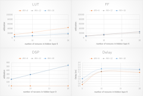
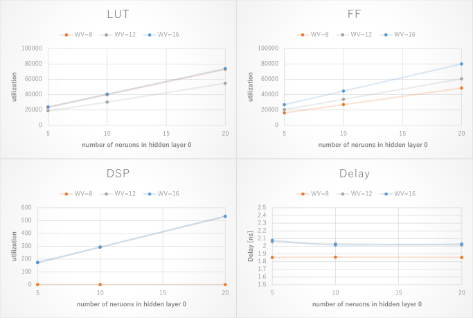
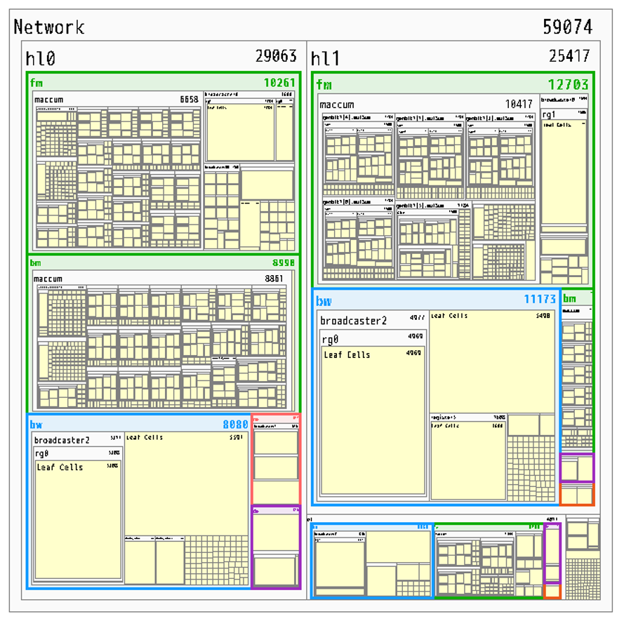
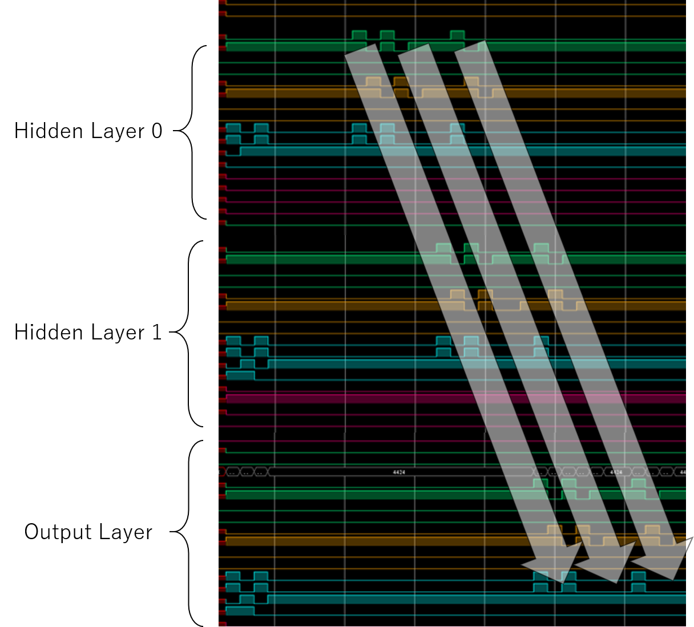
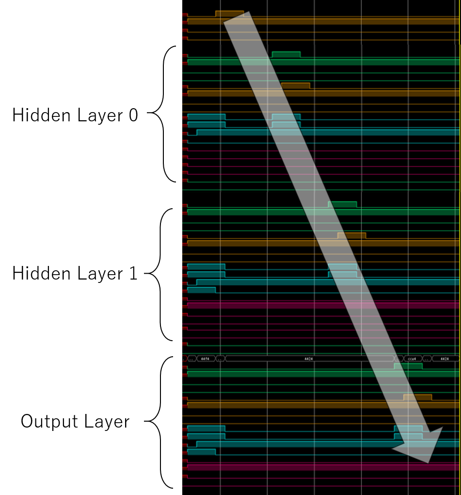
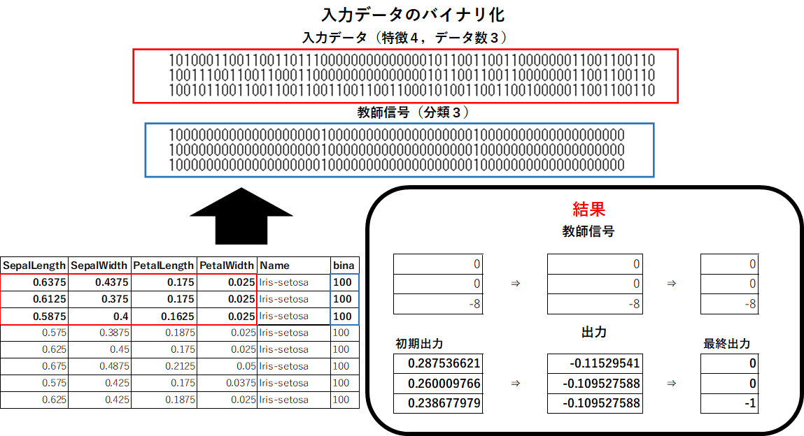

# LSIデザインコンテスト2019 レポート

## Team Information

チーム名：とっとこタム太郎  
学校名：九州工業大学 大学院 生命体工学研究科 田向研究室  
電話番号：093-695-6143（研究室）  
住所：〒808-0196 福岡県北九州市若松区ひびきの２−４  

## メンバーリスト

|学年|氏名|メールアドレス|Tシャツのサイズ|
|:---|:---|:---|:---|
|D1|川島 一郎|kawashima.ichiro172@mail.kyutech.jp|M|
|D1|田中 悠一朗|tanaka.yuichiro483@mail.kyutech.jp|L|
|M1|宮﨑 椋瑚|miyazaki.ryogo211@mail.kyutech.jp|L|

## 設計のタスクレベル
様々な構造のネットワークで学習・推論が可能．
IRISデータセットで検証．

<!--- break -->

## 1. 回路ブロックもしくは、アーキテクチャ記述

図 1.1．ニューラルネットワーク回路 ブロック図

図1.1に，今回設計したニューラルネットワーク回路のブロック図を示す．
図は，2層の隠れ層と1層の出力層から成る，Multi Layer Perceptron（MLP）を示している．
各層は，以下の4種類の回路モジュールの組み合わせで構成されている．
* 積和演算回路（Maccum）
* 活性化関数回路（Neuron）
* 誤差逆伝播回路（Delta）
* 荷重・バイアス回路（BiasWeight）

回路は下記に示すパラメータを持ち，回路を構成する4つのモジュールは，パラメタライズされている．後述する回路規模の検証では，このパラメータを可変にすることで回路規模の変化を確認する．
* NI：入力層のニューロン数
* NH0：隠れ層0のニューロン数
* NH1：隠れ層1のニューロン数
* NO：出力層のニューロン数
* WV：ニューロンの出力値のビット幅

各モジュールはValid信号とReady信号によるハンドシェイク方式で接続されている．図中の矢印は各モジュールの接続を示している．点線の矢印によって示される接続部分は，推論モードの時のみ通信を行う．各モジュールの詳細なインターフェースについては後述する．

MLPの順伝播の演算には，積和演算回路と活性化関数回路，荷重・バイアス回路が用いられる．各層の積和演算回路（順伝播用）は，前の層の出力と，荷重・バイアス回路から与えられる重みとバイアスの両方を受け取った後，積和演算によってニューロンの内部状態を計算する．ニューロンの内部状態は活性化関数回路へと入力され，ニューロンの出力値を計算する．この処理を全ての層について行う．

MLPの出力層の逆伝播の演算は，誤差逆伝播回路が用いられる．誤差逆伝播回路はニューロンの出力（出力層は活性化関数をかけない仕様のため，ニューロンの内部状態を受け取る）と，教師信号を受け取る．この回路は，ニューロンの出力と教師信号の差を計算する．これは誤差関数として設定したMean Squared Errorの微分に相当する．

MLPの隠れ層の逆伝播の演算は，誤差逆伝播回路と積和演算回路が用いられる．まず積和演算回路が次の層の重みと，次の層の誤差の両方を受け取り，積和演算を行う．次に誤差逆伝播回路が，上記積和演算の結果とニューロンの内部状態を受け取り，誤差を算出する．ここでニューロンの内部状態は，その層における活性化関数の微分値を調べるために用いられる．この処理を全ての隠れ層について行う．

MLPの重みとバイアスの更新は，各層の荷重・バイアス回路によって行われる．荷重・バイアス回路には，重みとバイアスを保持するためのレジスタが存在している．この回路は誤差逆伝播回路から与えられる誤差と，前の層の活性化関数回路から与えられる入力ちの両方を受け取った後，重みとバイアスの更新量を算出し，更新後の重みとバイアスをレジスタに保存する．

<!--- break -->

## 2. 設計した回路の機能の説明など
### 2.1. インターフェース
#### 2.1.1. Broadcaster・Combiner

以下に，BroadcasterとCombinerの回路ブロック図を示す．

図 2.1．Broadcaster・Combiner

Broadcaster，Combinerはそれぞれ，ハンドシェイクプロトコルで流れるデータの分配，統合をを行う．これにより，ハンドシェイクプロトコルのデータフロー制御を行っている．

Broadcasterは，1つのデータソースから受け取ったデータを2つのデータシンクに受け渡すためのモジュールである．データソースからデータを受け取ると，2つのデータシンクにそれぞれ，データを受け渡す．2つのデータシンクがデータを受け取るまでの間，データソースからのデータを受け取らず，データフローをストールする．

Combinerは，2つのデータソースから受け取ったデータを1つのデータシンクに受け渡すためのモジュールである．2つのデータソースからデータを受け取るまでの間，データシンクにはデータを受け渡さず，データフローをストールする．2つのデータソースからのデータが揃ったときにデータシンクにデータを受け渡す．

Broadcaster，CombinerにはRegister（深さ1のキュー）が内蔵されておりハンドシェイクプロトコルのマスターとして機能する．Registerモジュールは通常モードとバーストモードがある．通常モードではデータ転送を２クロックサイクルおきにしか行うことができないが少ない回路リソースで実装可能である．一方で，バーストモードでは毎クロックサイクルデータを転送可能であるが実装に必要な回路リソース数が増加する．

#### 2.1.2. Pipeline Register
図2.2にPipeline Registerの回路ブロック図を示す．

モジュール内の処理をいくつかのステージに分割し，パイプライン処理を行わせるときに，Pipeline Registerが用いられる．Pipeline Registerは各ステージ間に配置されて，あるステージから次のステージへデータを受け渡す．出力側のReady信号がHIGHで，入力側のValid信号がHIGHになったときにデータが次のステージへ受け渡される．

図 2.2．Pipeline Register

<!--- break -->

### 2.2. ニューラルネットワーク専用回路
#### 2.2.1. 積和演算回路
以下に，積和演算回路のブロック図を示す．

図 2.3．積和演算回路

積和演算回路はニューロン回路や誤差伝搬回路への入力値の計算に必要な積和演算を行う回路である．積和演算回路は出力側の要素数数と同数のMaccumモジュールで構成されている．Maccumには，入力側要素数と同数の乗算回路（Mul）と1つの総和計算回路（Sum）で構成され，総和計算回路では加算回路をツリー状に配置している．積和演算回路内のモジュールは全てハンドシェイクプロトコルで接続されており，演算回路の段数の差によるデータのタイミングのズレが吸収されている．

図 2.3はニューロン回路への入力値を計算する回路（FowardMaccum）であり，誤差伝搬回路への入力値を計算する回路（BackwordMaccum）は積和演算後のバイアスの加算を行っていない．

#### 2.2.2. 活性化関数回路
図2.4に，活性化関数回路のブロック図を示す．

活性化関数回路は，自身のレイヤーの積和演算回路から入力を受け付ける．活性化関数回路に入力された信号は，ニューロンの内部状態毎に分割され，各信号は図に示すReLUブロックへと入力される．

ReLUブロックは入力された信号を，0からMAX（出力信号のビット幅で取りうる最大値）までクリッピングする．本来のReLU関数は，出力値に上限はない．しかし，本設計回路では活性化関数の出力値のビット幅を制限する仕様とした．これは，ニューラルネットワークの層を経る毎に，ニューロンの入力信号のビット幅を増加させないためである．

各ReLUブロックが計算した値は，全てBroadcasterへと入力される．Broadcasterによって，活性化関数回路の出力は，次のレイヤーの積和演算回路と，自身の荷重・バイアス回路に入力される．

図 2.4．活性化関数回路

#### 2.2.3. 誤差伝播回路

図 2.5．誤差逆伝播回路

図2.5に，誤差伝搬回路を示す．

誤差伝搬回路ではネットワークの荷重値の更新に必要な誤差の計算を行う．CalcDeltaは誤差の計算を行うモジュールであり，

**中間層の場合：**

定数値の1，0と順伝搬の積和演算回路の出力値（a1）の比較を行い，
* 0 < a1 < 1 → 逆伝搬の積和演算回路の出力値（a2）
* otherwise  → 0
を出力する．

**出力層の場合：**

（順伝搬の積和演算回路の出力値（a1）） - （逆伝搬の積和演算回路の出力値（a2））
の値を出力する．

また，積和演算結果は-1よりも小さい場合や，1よりも大きい場合があるので，Saturation回路で出力値の飽和処理を行っている．

#### 2.2.4. 荷重・バイアス回路
図2.6に，荷重・バイアス回路を示す．

荷重・バイアス回路は，活性化関数回路と誤差逆伝播回路から入力を受け付ける．
各信号は，まずCombinerに入力される．したがって，活性化関数回路の出力（図中 y1）と，誤差逆伝播回路の出力（図中 d0）の両方が揃ってから，重みとバイアスの更新の処理を開始する．

上記信号はまず，Learning rateブロックへと入力される．Learning rateブロックはd0に学習率を乗じた値（図中 ad）を出力する．このadは，バイアスの更新量（図中 db）に相当する．このブロックでは，y1については処理を加えない．上記adとy1はPipeline Registerを通じて，Delta_wブロックへと入力される．Delta_wブロックは，y1とadの乗算（図中 dW）を出力する．このdWは，重みの更新量に相当する．上記dbとdWはUpdateブロックへと入力される．Updateブロック内には，重みとバイアスの値を保存するレジスタがある．入力されたdbとdWを用いて，バイアスと重みの更新を行う．

更新された重みとバイアスはBroadcasterへと入力される．Broadcasterによって，重みとバイアスが自身のレイヤーの積和演算回路へ入力され，重みが前のレイヤーの誤差逆伝播回路へ入力される．

図 2.6．荷重・バイアス回路

<!--- break -->

## 3. アピールポイントと独創性
* モジュール間の通信をハンドシェイクプロトコルで行っている
 * 複雑な制御回路が不要
 * パイプライン処理の設計が容易
 * モジュールの追加・変更・組み替えが容易
* 回路がパラメタライズされている
 * ビット精度やネットワークの構造を容易に変更できる
 * 様々なタスクに対応可能
* 荷重値とバイアスを合成時に乱数で初期化
 * XorShiftを使用した高品質な乱数

<!--- break -->

## 4. クリティカルパス速度、回路領域
論理合成ツールとしてXilinx Vivado 2018.2を使用した．
ターゲットデバイスはXilinx Virtex UltraScale+(VCU1525 アクセラレータカード)とし，合成時のターゲット周波数は200\[MHz\]とした．

### 通常モード

以下の表はBroadcaster，Combiner内のRegisterモジュールが通常モードの際の使用回路リソース数，クリティカルパス遅延を表している．

リソース（通常モード）| 使用数 (NH0 = 5) | 使用数 (NH0 = 10) | 使用数 (NH0 = 20)
------------: | :---- | :---- | :----
LUT (WV = 8)  | 14453 | 24197 | 44738
LUT (WV = 12) | 5161  | 8505  | 16216
LUT (WV = 16) | 6423  | 10574  | 19460
FF  (WV = 8)  | 8752  | 14567 | 26160
FF  (WV = 12) | 6509  | 11629 | 20583
FF  (WV = 16) | 8249  | 14798 | 26447
DSP (WV = 8)  |    0  | 0     | 0
DSP (WV = 12) |  173  | 293   | 533
DSP (WV = 16) |  173  | 293   | 533

最大遅延（通常モード） | 時間（NH0 = 5） | 時間（NH0 = 12） | 時間（NH0 = 16）
------: | :-- | :-- | :--
 WV = 8 | 1.568 ns | 2.115 ns | 2.083 ns
WV = 12 | 1.671 ns | 2.131 ns | 2.187 ns
WV = 16 | 1.815 ns | 2.237 ns | 2.218 ns

図 4.1．回路リソース，回路遅延（通常モード）

また，図 4.1は上記の表をグラフで表したものである．
それぞれのグラフの横軸は1つ目の隠れ層のニューロン数を表しており，データのビット精度を8，12，16に変化させ，それぞれの場合のリソース数，最大遅延を計測した．

隠れ層のニューロン数が増加するに従って，使用回路リソース数が増加していることが分かる．
使用LUT数は，ビット精度が8の場合がビット精度12，16の場合を上回っている．
ビット精度が8の場合，使用DSP数が0であることから，積和演算回路内の乗算器の実装にDSPではなく，LUTが消費されていることが原因であると考えられる．

また，クリティカルパスの最大遅延は2\[ns\]前後であることが分かる．

### バーストモード

以下の表はBroadcaster，Combiner内のRegisterモジュールがバーストモードの際の使用回路リソース数，クリティカルパス遅延を表している．

リソース（通常バースト）| 使用数 (NH0 = 5) | 使用数 (NH0 = 10) | 使用数 (NH0 = 20)
------------: | :---- | :---- | :----
LUT (WV = 8)  | 23642 | 40019 | 73152
LUT (WV = 12) | 18895  | 30307  | 54818
LUT (WV = 16) | 23906  | 40738 | 73951
FF  (WV = 8)  | 16254  | 26984 | 48513
FF  (WV = 12)  | 20480  | 33872 | 60604
FF  (WV = 16) | 26982  | 44647 | 79961
DSP (WV = 8)  |    0  | 0     | 0
DSP (WV = 12) |  173  | 293   | 533
DSP (WV = 16) |  173  | 293   | 533

|最大遅延（通常モード） | 時間（NH0 = 5） | 時間（NH0 = 12） | 時間（NH0 = 16）|
|-----:|:---|:---|:---|
|WV = 8 | 1.854 ns | 1.858 ns | 1.854 ns|
|WV = 12 | 2.057 ns | 2.032 ns | 2.016 ns|
|WV = 16 | 2.077 ns | 2.018 ns | 2.028 ns|

図 4.2．回路リソース，回路遅延（バーストモード）

また，図 4.2は上記の表をグラフで表したものである．
バーストモードでは回路のレイテンシが半分になる代わりに，Registerモジュールで消費する回路リソース数が増加する．
図 4.2から，FFの使用リソース数が他のリソースに比べて顕著に増加していることが分かる．

図 4.3．モジュールごとの消費リソース数

図 4.3．ではモジュールごとの消費リソース数が大小関係で表されている．
緑色，青色，オレンジ色，紫色の部分はそれぞれ，積和演算回路，重み・バイアス回路，活性化関数回路，誤差伝搬回路を表している．
この図から，回路リソースの大部分が積和演算回路と重み・バイアス回路で消費されていることが分かる．

<!--- break -->

## 5. HDLコード
GitHubにて公開．  
https://github.com/IchiroKawashima/LSI-Design-Contest-2019/

<!--- break -->

## 6. シミュレーション

### 6.1. Valid信号とReady信号の波形
図6.1に，作成した回路を用いて，3回の順伝播処理を行い，2回の逆伝播処理を学習モードで行なった時の論理シミュレーションの波形を示す．この波形では全てのモジュールのValid信号とReady信号を示している．上から順番に隠れ層0，隠れ層1，出力層のモジュール毎に並べてある．図の矢印に示すように，順伝播の計算時には，Valid信号とReady信号が同時にHIGHになっているタイミングが，入力層側から出力層側に伝播している様子が確認できた．また，逆伝播の計算時には，Valid信号とReady信号が同時にHIGHになっているタイミングが，出力層側から入力層側に伝播している様子が確認できた．

図 6.1．Valid信号とReady信号（学習モード）

図6.2に，作成した回路を用いて，3回の順伝播処理を推論モードで行なった時の論理シミュレーションの波形を示す．尚，Broadcaster，Combiner内のRegisterモジュールは通常モードに設定した．この波形では全てのモジュールのValid信号とReady信号を示している．上から順番に隠れ層0，隠れ層1，出力層のモジュール毎に並べてある．図の矢印に示すように，Valid信号とReady信号が同時にHIGHになっているタイミングが，入力層側から出力層側に伝播している様子が確認でき，連続して3つの入力がパイプライン処理されていることが確認できた．

図 6.2．Valid信号とReady信号（推論モード・通常モード）

図6.3に，作成した回路を用いて，3回の順伝播処理を推論モードで行なった時の論理シミュレーションの波形を示す．尚，Broadcaster，Combiner内のRegisterモジュールはバーストモードに設定した．この波形では全てのモジュールのValid信号とReady信号を示している．上から順番に隠れ層0，隠れ層1，出力層のモジュール毎に並べてある．図の矢印に示すように，Valid信号とReady信号が同時にHIGHになっているタイミングが，入力層側から出力層側に伝播している様子が確認でき，3つの入力が連続して処理されていることが確認できた．

図 6.3．Valid信号とReady信号（推論モード・バーストモード）

### 6.2. 理論値との比較
作成した回路が，ニューラルネットワークの計算を正しく再現できているかどうかを確認した．ここでは，ニューラルネットワークの重みとバイアスを乱数で初期化した状態で，入力データとしてランダムな値をネットワークに与えたときの，各層の活性化関数回路の出力値と，誤差逆伝播回路の出力値を論理シミュレーションで計測し，理論値との比較を行った．ニューラルネットワークの各種パラメータは，NI＝3，NH0=2，NH1=3，NO=2，WV=16とした．

表6.1に，理論値と測定値の比較表を示す．表中のIterは学習のループを示しており，Iter 1が1回目の学習，Iter 2が2回目の学習を意味する．表に示すように，理論値と測定値に誤差が見受けられたが，これはビット精度の違い（理論値は浮動小数演算で算出）によるものと考えられる．

表 6.1．理論値と測定値の比較表

### 6.3. IRISデータセットを用いた学習
作成した回路が，ニューラルネットワークの学習を正しく再現できているかどうかを確認した．ここでは，IRISデータセットの中から同じラベルに属する3サンプルを選択し，教師信号として[0, 0, -8]をネットワークに与えて学習させ，ネットワークの出力の変化を確認した．図6.3に，ネットワークの出力の変化を示す．図に示すように，学習とともにネットワークの出力が，教師信号の値に近づいていく様子が確認できた．

図 6.4．IRISデータセットを用いた学習

